|
Deep Learning, Machine Learning Experiments 

Bánóczy Martin, Durkó Vince
|
| :- |
||
|
Abstract 

This paper is a documentation for the repository below, where we tried to gain a deeper understanding of the more basic deep learning and machine learning concepts and experiment with these techniques on different datasets. 

[https://github.com/polymons/Deep-Learning-Experiments ](https://github.com/polymons/Deep-Learning-Experiments)
|

[Abstract .................1 ](#_page0_x34.00_y468.92)[Network traffic analysis ..........................3](#_page2_x34.00_y87.92)

[Visualize the data ............................3 ](#_page2_x34.00_y176.92)[Preprocessing .5 ](#_page4_x34.00_y87.92)[Processing categorical features .......6 ](#_page5_x34.00_y87.92)[Models ............8 ](#_page7_x34.00_y87.92)[Random Forest Regressor ........8 ](#_page7_x34.00_y113.92)[Elastic Net ...............................9 ](#_page8_x34.00_y87.92)[SVR ..........9 ](#_page8_x34.00_y353.92)[Evaluation .......9](#_page8_x34.00_y600.92)

[Google Play Store app data analysis .....10](#_page9_x34.00_y87.92)

[Data visualization ..........................10 ](#_page9_x34.00_y176.92)[Preprocessing ...............................12 ](#_page11_x34.00_y87.92)[Models ..........12](#_page11_x34.00_y154.92)

[Multi-Layer Perceptron Regressor ...........................12 ](#_page11_x34.00_y180.92)[Support Vector Regression .....12 ](#_page11_x34.00_y405.92)[Evaluation .....13](#_page12_x34.00_y87.92)

[Spam Or Ham ......14](#_page13_x34.00_y87.92)

[Preprocessing ...............................14 ](#_page13_x34.00_y162.92)[Models ..........15 ](#_page14_x34.00_y98.92)[Sequential ..............................15 ](#_page14_x34.00_y137.92)[Using Tokenizer .....................15 ](#_page14_x34.00_y474.92)[Evaluation .....16 ](#_page15_x34.00_y87.92)[Classification statistics ...........16 ](#_page15_x34.00_y503.92)[Classification report ...............17 ](#_page16_x34.00_y87.92)[ROC .......17 ](#_page16_x34.00_y402.92)[Precision-Recall curve ............18 ](#_page17_x34.00_y87.92)[Manual testing ..............................19](#_page18_x34.00_y87.92)

[Conclusion ...........20 ](#_page19_x34.00_y87.92)[Resources ............21](#_page20_x34.00_y87.92)
# Network traffic analysis
**Objective:** Clustering the data and predictive analysis of cyberattacks and type of network traffic based on processing the dataset.
### Visualize the data 
As a first step, we examine our data set to find out what aspects of it can be used to model its behaviour in the future. 

**Value categories in a row:**

Timestamp, Source IP Address, Destination IP Address, Source Port, Destination Port, Protocol, Packet Length, Packet Type, Traffic Type, Payload Data, Malware Indicators, Anomaly Scores, Alerts/Warnings, Attack Type, Attack Signature, Action Taken, Severity Level, User Information, Device Information, Network Segment, Geo-location Data, Proxy Information, Firewall Logs, IDS/IPS Alerts, Log Source 

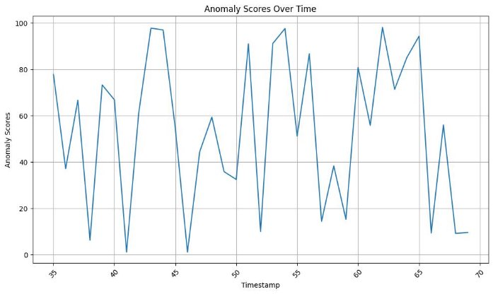

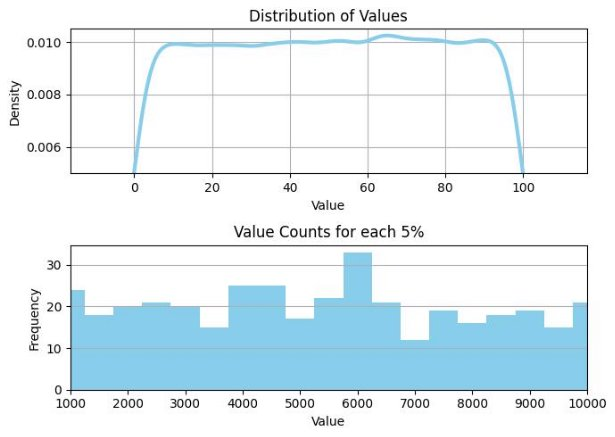

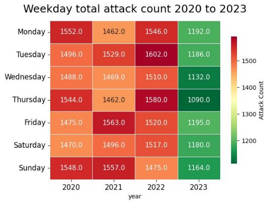
### Preprocessing 
At this stage, we had to discard a lot of data because it was incorrect/had missing values. Furthermore, the data set is too homogeneous, there are no significant relationships or patterns between the data.

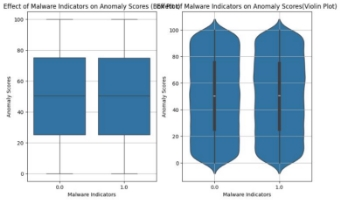 

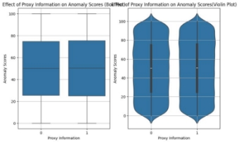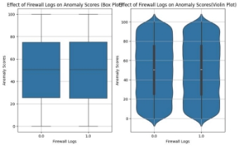

We tried to look and find distinctive characteristics of the data.

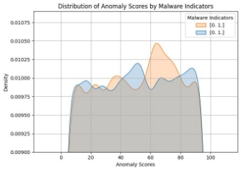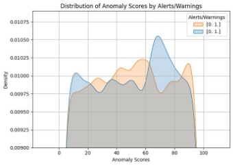
### Processing categorical features
If we divide and examine the data set by **protocol** (Figure 1) or **traffic type** (Figure 2), it turns out that there are no easy-to-learn patterns in this case either. It is impossible to draw conclusions based on the properties.

|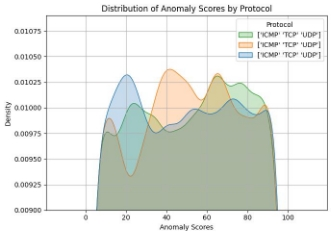|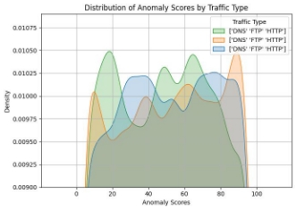|
| - | - |

We can see that the data is evenly distributed whether we look at it in terms of protocol used (ICMP, TCP, UDP) or traffic type (DNS, FTP, HTTP). It is a fair assumption to try and look at **packet length** instead, as DDoS attacks might want to maximize the payload size, or some hazardous application might want to hide its activity and communicate using the minimum amount of traffic. It turns out this hypothesis is wrong. We do **no**t find any **correlation between packet length and** it being **danger**ous. 

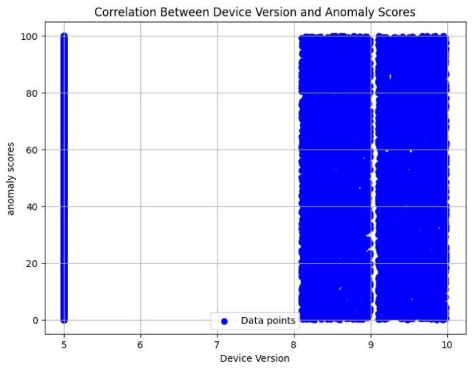

Another characteristic that we might think as important is device version. When it comes to this dataset the assumption is wrong, there is no correlation between device version and anomaly scores.
### Models 
##### Random Forest Regressor 
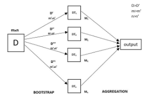
Formula for MSE, also known as R^2 score:

Where: 

- Yi is the ith observed value.
- yi is the corresponding predicted value.
  - n = the number of observations.

*Random Forest Regressor Model R^2 score: -0.03373074618991856* 
##### Elastic Net 

*Model R^2 score: 1.4455878746488793e-05* 
##### SVR 

*Model R^2 score: -0.007977431180027805*
### Evaluation 
After training and cross validating, we can look at the **mean squared error** of the pipeline to check its usability. 

Despite well designed pipelines, the project encountered significant challenges stemming from two main factors: **inadequate data quantity** and the **homogeneity of the available data**. With insufficient samples, the models struggled to capture the complexities and variations present in real-world scenarios. As a result, their predictive performance remained suboptimal, unable to achieve the desired level of accuracy and reliability.
# Google Play Store app data analysis
**Objective:** To find out the relationship between the characteristics of a given software uploaded to the app store, such as price, topic, supported Android version, and its success.!
### Data visualization 
Which categories have the highest average number of installs and ratings? Are there any underserved categories with high growth potential?

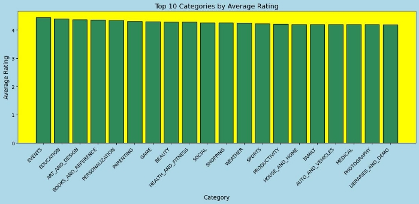

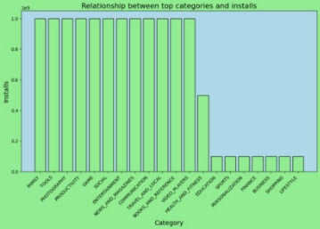Can we identify categories where users are more willing to pay for apps? What pricing strategies are effective in these categories?

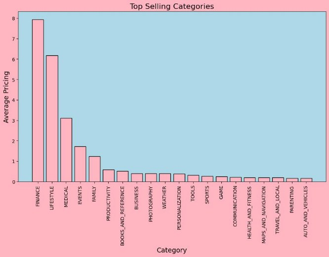

### Preprocessing 
- Original dataset size: 10840
- Under sampled dataset size: 3207
### Models 
##### Multi-Layer Perceptron Regressor

Support Vector Regression

### Evaluation 
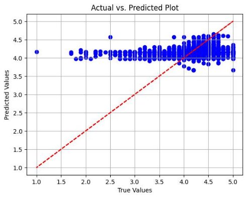

The dataset shows most apps fall into a small area when it comes to rating.

In addition to MLP and SVR, other deep learning architectures might be more suitable for the app store dataset include CNNs, RNNs like LSTMs, transformer models like BERT, GNNs, and autoencoders. CNNs can analyse textual data, RNNs capture sequential dependencies, transformers excel in NLP tasks, GNNs handle relational structures, and autoencoders aid in dimensionality reduction and anomaly detection. These models offer potential for deeper insights into user behaviour, app characteristics, and market dynamics, enhancing decision-making for developers and stakeholders.
# Spam Or Ham
**Objective:** Binary classification, labeling text messages as spam (dangerous) or "ham" (non-dangerous).
### Preprocessing 
Spam in the dataset:  29.540 % Ham 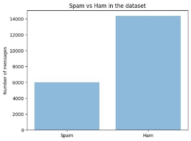in the dataset:  70.459 % Spam in the test set:  28.427 % Ham in the test set:  71.572 % Spam in the training set:  29.819 % Ham in the training set:  70.180 %

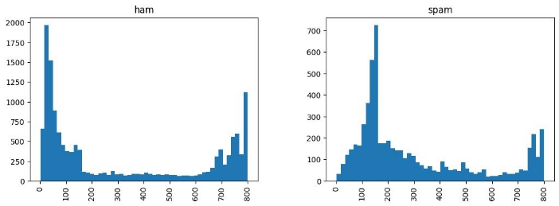

Message length for ham vs spam
### Models 
##### Sequential 
- Test set: 20%
- Activation function: Relu
- Optimizer: adam

- Total params: 10,918,853 (41.65 MB)
- Trainable params: 3,639,617 (13.88 MB)
- Non-trainable params: 0 (0.00 B)
- Optimizer params: 7,279,236 (27.77 MB)
##### Using Tokenizer 
To derive more useful data, we can work on a more pre-processed dataset by using tokenizers.

Incorporating tokenization techniques in spam detection offers a refined feature space, reducing dimensionality and computational overhead. By segmenting textual data into tokens, nuanced linguistic cues indicative of spam or non-spam messages are captured, enhancing classification accuracy. Additionally, domain-specific tokenization strategies enable the integration of specialized knowledge, augmenting model robustness. This approach underscores the significance of tailored preprocessing methods in optimizing model performance and advancing natural language processing applications.

- word categories count: 13
- unique output_images/Words count: 57636
- first line's window size: 13
### Evaluation 
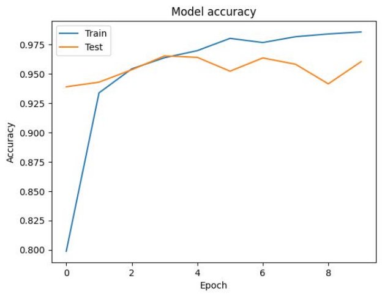

**Test Loss:** 0.13205815851688385  **Test Accuracy:** 0.9601965546607971 
##### Classification statistics 

||precision** |recall** |f1-score** |support** |
| :- | - | - | - | - |
|0 |0\.96 |0\.98 |0\.97 |2913 |
|1 |0\.96 |0\.90 |0\.93 |1157 |
|Accuracy |||0\.96 |4070 |
|Macro avg. |0\.96 |0\.94 |0\.95 |4070 |
|Weighted avg. |0\.96 |0\.96 |0\.96 |4070 |
##### Classification report 

##### ROC** 
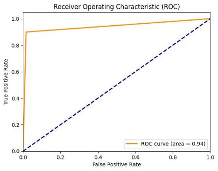

Comparing values classified as positive that are genuinely positive with false positives
##### Precision-Recall curve 
- **Precision:** true positives / (true positives + false positives) 
- **Recall:** true positives / (true positives + false negatives) 

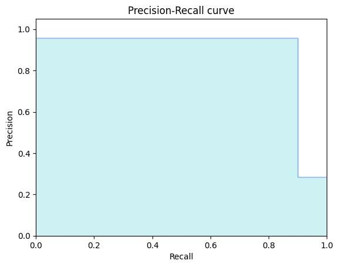

**Average precision score:** 0.890166433457421 
### Manual testing 
We can see how the model reacts to a clearly spam message:

We can also predict the clearly harmless version with high certainty (about 92%):

More interesting test cases are when the text contains certain keyoutput_images/Words commonly used by scammers. As we would expect the confidence of the model decreases as we add these to a regular message:

# Conclusion 
This study delved into the applications of deep learning and machine learning across varied domains, encompassing network traffic analysis, Google Play Store app data analysis, and spam detection. Despite employing robust methodologies, challenges such as limited data availability and homogeneity in the datasets were encountered, impacting predictive performance in network traffic analysis. Nonetheless, insights gleaned from app data analysis shed light on user behaviour and effective pricing strategies. In spam detection, deep learning techniques demonstrated notable accuracy in classifying messages. Overall, while challenges persisted, this study highlights the versatile nature of deep learning and machine learning, emphasizing the necessity for continued exploration and innovation in these fields.
# Resources
- <https://bitbucket.org/szenasis/deeplearningcntk/src/master/>
- <https://www.kaggle.com/datasets/teamincribo/cyber-security-attacks/data>
- [https://youtu.be/hfMk-kjRv4c ](https://youtu.be/hfMk-kjRv4c)
- <https://www.youtube.com/@3blue1brown>
- <https://docs.jupyter.org/en/latest/>
- <https://scikit-learn.org/stable/modules/generated/sklearn.neural_network.MLPClassifier.html>
- [https://michael-fuchs-python.netlify.app/2021/02/03/nn-multi-layer-perceptron-classifier - mlpclassifier/](https://michael-fuchs-python.netlify.app/2021/02/03/nn-multi-layer-perceptron-classifier-mlpclassifier/)
- [https://www.kaggle.com/datasets/mexwell/telegram-spam-or-ham/ ](https://www.kaggle.com/datasets/mexwell/telegram-spam-or-ham/)
- [https://www.kaggle.com/datasets/lava18/google-play-store-apps ](https://www.kaggle.com/datasets/lava18/google-play-store-apps)
- <https://scikit-learn.org/stable/modules/generated/sklearn.ensemble.RandomForestRegressor.html>
- [https://www.geeksforgeeks.org/random-forest-regression-in-python/ ](https://www.geeksforgeeks.org/random-forest-regression-in-python/)
- <https://scikit-learn.org/stable/modules/generated/sklearn.linear_model.ElasticNet.html>
- [https://www.kaggle.com/datasets/mexwell/telegram-spam-or-ham/ ](https://www.kaggle.com/datasets/mexwell/telegram-spam-or-ham/)
- <https://www.tensorflow.org/api_docs/python/tf/keras/Sequential>